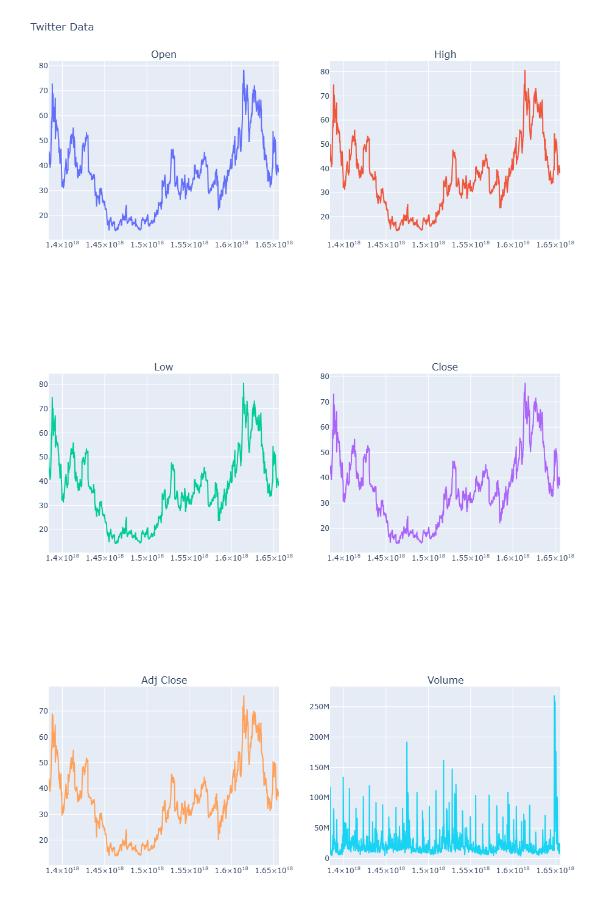
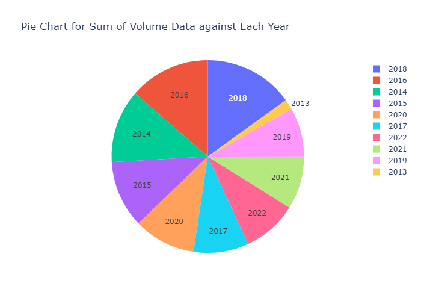
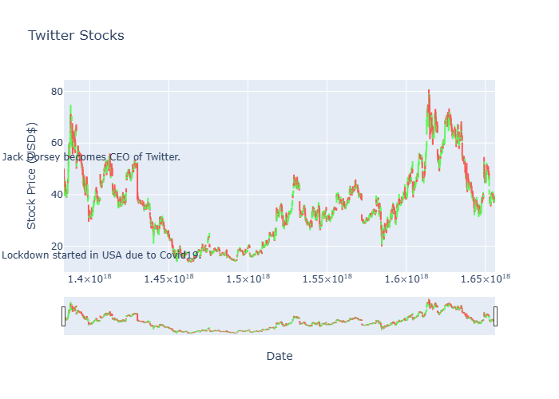
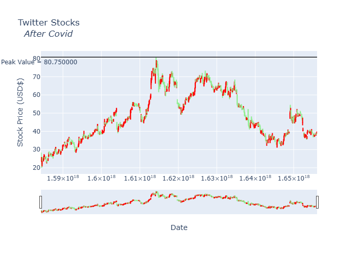
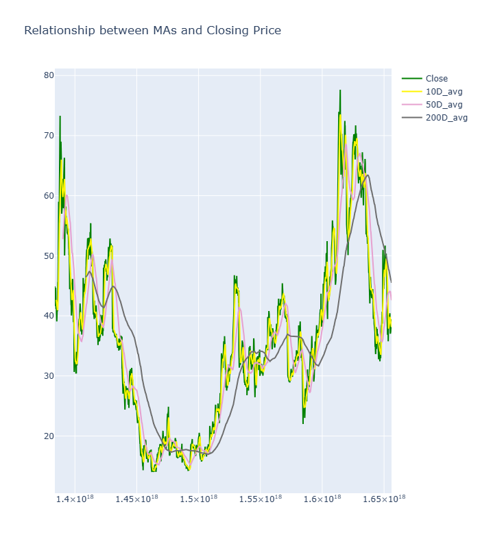
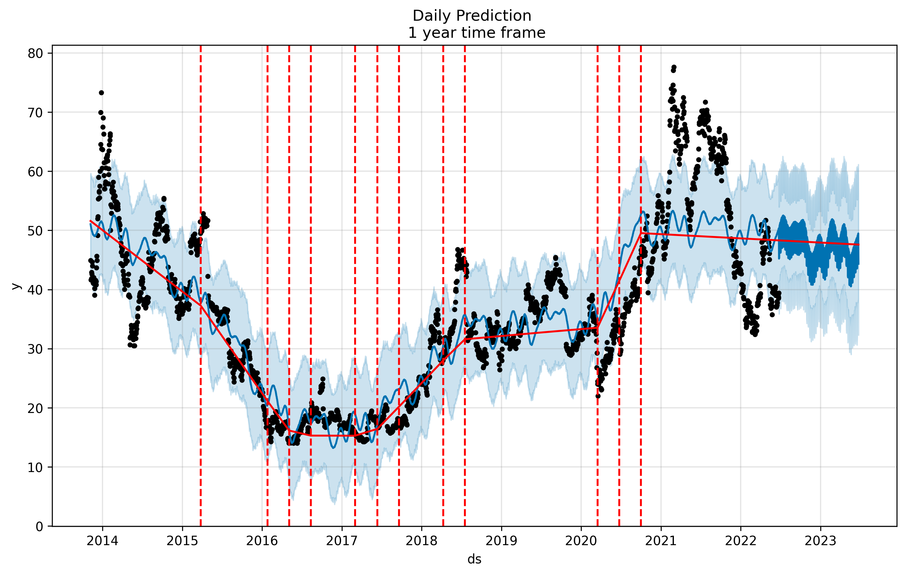
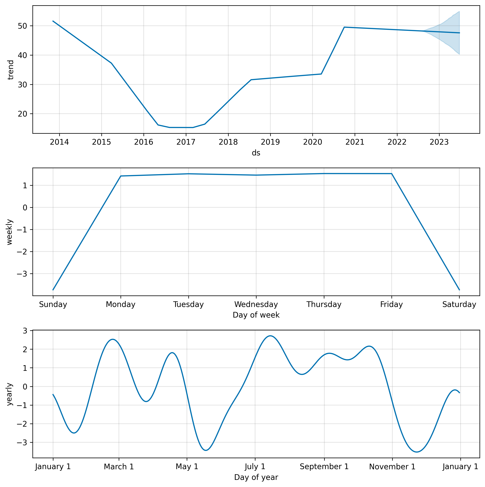
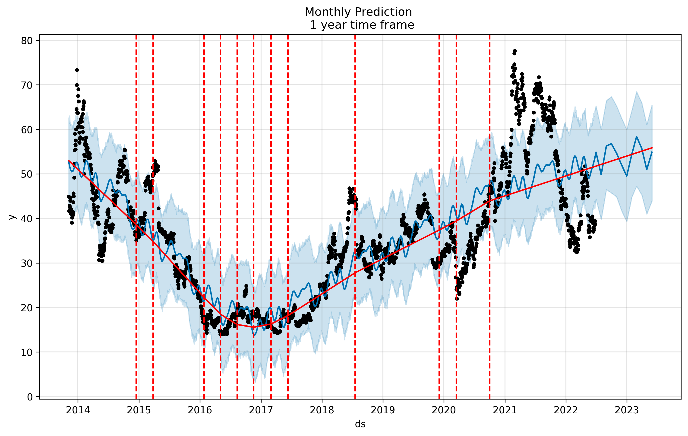
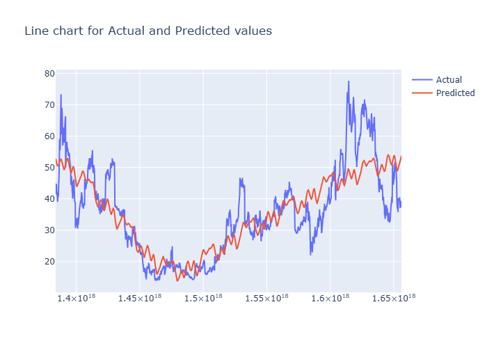

# 📈 Twitter Stock Price Analysis & Forecasting with Prophet

[](https://www.python.org/downloads/)
[](https://jupyter.org/)
[](https://facebook.github.io/prophet/)
[](https://plotly.com/)

A comprehensive time series analysis and forecasting project for Twitter stock prices using Facebook's Prophet model. This project includes exploratory data analysis, visualization, and future stock price predictions.

## 🎯 Project Overview

This project analyzes Twitter stock price data and builds predictive models using Prophet to forecast future stock prices. The analysis includes multiple visualization techniques to understand stock patterns, trends, and seasonal effects.

## 📊 Key Features

- **Comprehensive Data Analysis**: Statistical analysis and data exploration
- **Interactive Visualizations**: Beautiful charts using Plotly and Matplotlib
- **Time Series Forecasting**: Advanced forecasting using Facebook's Prophet
- **Moving Average Analysis**: Technical analysis with 10, 50, and 200-day moving averages
- **Performance Evaluation**: Model accuracy assessment using Mean Absolute Error

## 🖼️ Project Visualizations

### 📈 Stock Data Overview

*Comprehensive view of all stock metrics including Open, High, Low, Close, Adjusted Close, and Volume*

### 📊 Volume Analysis by Year

*Distribution of trading volume across different years*

### 📉 OHLC Stock Chart

*Open-High-Low-Close chart with key historical events marked*

### 🕯️ Post-COVID Analysis

*Detailed candlestick analysis focusing on post-COVID stock behavior*

### 📈 Moving Averages Analysis

*Relationship between closing prices and moving averages (10D, 50D, 200D)*

### 🔮 Prophet Forecasting Results

#### Daily Predictions

*Daily stock price predictions for 1 year ahead*


*Trend and seasonal components breakdown for daily predictions*

#### Monthly Predictions

*Monthly stock price predictions for 1 year ahead*


*Trend and seasonal components breakdown for monthly predictions*

### 🎯 Model Performance

*Comparison between actual and predicted stock prices*

## 🛠️ Technologies Used

- **Python 3.8+**
- **Pandas** - Data manipulation and analysis
- **NumPy** - Numerical computing
- **Matplotlib** - Static plotting
- **Plotly** - Interactive visualizations
- **Prophet** - Time series forecasting
- **Scikit-learn** - Model evaluation metrics

## 📋 Requirements

```bash
pandas
numpy
matplotlib
plotly
prophet
scikit-learn
nbformat>=4.2.0
kaleido
```

## 🚀 Getting Started

1. **Clone the repository**
   ```bash
   git clone <repository-url>
   cd "Twitter stock price data - Time Series Forecasting with Prophet"
   ```

2. **Create a virtual environment**
   ```bash
   python -m venv venv
   source venv/bin/activate  # On Windows: venv\Scripts\activate
   ```

3. **Install dependencies**
   ```bash
   pip install -r requirements.txt
   ```

4. **Run the Jupyter notebook**
   ```bash
   jupyter notebook jupyter.ipynb
   ```

## 📁 Project Structure

```
📦 Twitter Stock Price Analysis
├── 📄 jupyter.ipynb          # Main analysis notebook
├── 📄 TWITTER.csv            # Stock price dataset
├── 📄 requirements.txt       # Project dependencies
├── 📄 .gitignore            # Git ignore file
├── 📄 README.md             # Project documentation
└── 📁 images/               # Generated visualizations
    ├── 🖼️ twitter_data_subplots.png
    ├── 🖼️ volume_pie_chart.png
    ├── 🖼️ twitter_ohlc_chart.png
    ├── 🖼️ twitter_candlestick_after_covid.png
    ├── 🖼️ moving_averages_chart.png
    ├── 🖼️ prophet_daily_prediction.png
    ├── 🖼️ prophet_daily_components.png
    ├── 🖼️ prophet_monthly_prediction.png
    ├── 🖼️ prophet_monthly_components.png
    └── 🖼️ actual_vs_predicted_comparison.png
```

## 📈 Key Analysis Tasks

1. **Data Import & Preprocessing** - Loading and cleaning Twitter stock data
2. **Statistical Analysis** - Descriptive statistics and data exploration
3. **Data Visualization** - Multiple chart types for comprehensive analysis
4. **Volume Analysis** - Year-wise trading volume comparison
5. **Technical Analysis** - OHLC charts with historical event markers
6. **COVID Impact Analysis** - Focused analysis on post-pandemic trends
7. **Moving Averages** - Technical indicators analysis
8. **Prophet Modeling** - Time series forecasting setup
9. **Predictions** - Daily and monthly future price forecasts
10. **Model Evaluation** - Performance assessment and validation

## 🎯 Key Insights

- **Historical Events Impact**: Clear visualization of how major events (CEO changes, COVID-19) affected stock prices
- **Seasonal Patterns**: Prophet model identifies underlying trends and seasonal components
- **Technical Indicators**: Moving averages provide insights into stock momentum and trends
- **Forecasting Accuracy**: Model performance evaluation shows the reliability of predictions

## 📊 Model Performance

The Prophet model achieves good forecasting accuracy with detailed component analysis showing:
- **Trend Component**: Long-term stock price direction
- **Seasonal Component**: Recurring patterns in stock behavior
- **Holiday Effects**: Impact of market holidays and events

## 🤝 Contributing

Feel free to fork this project, submit issues, or create pull requests for improvements!

## 📧 Contact Information

**Pavan Eleti**
- 📧 Email: [pavaneletisj@gmail.com](mailto:pavaneletisj@gmail.com)
- 💼 LinkedIn: [www.linkedin.com/in/pavan-eleti-800a48305](https://www.linkedin.com/in/pavan-eleti-800a48305)
- 🐱 GitHub: [https://github.com/PAVANKUMARELETI](https://github.com/PAVANKUMARELETI)
- 🌐 Portfolio: [www.pavaneleti.me](https://www.pavaneleti.me)

---

## 📄 License

This project is open source and available under the [MIT License](LICENSE).

---

⭐ **If you found this project helpful, please give it a star!** ⭐
