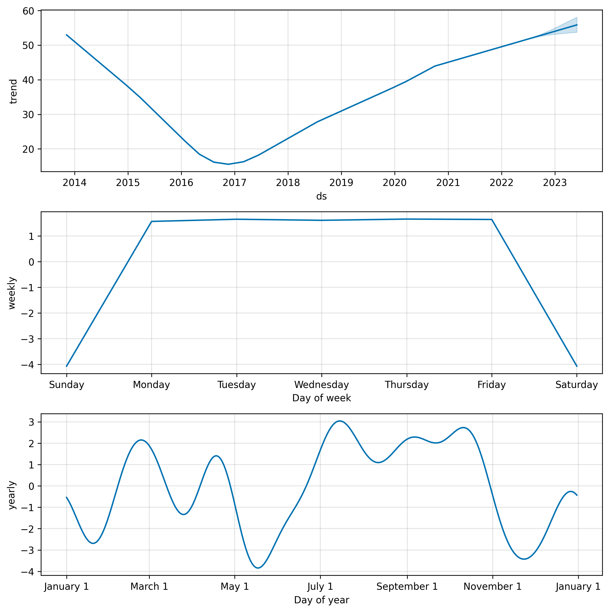

<div align="center">

# 📈 Twitter Stock Price Analysis & Forecasting with Prophet

[](https://www.python.org/downloads/)
[](https://jupyter.org/)
[](https://facebook.github.io/prophet/)
[](https://plotly.com/)

### 🚀 A comprehensive time series analysis and forecasting project for Twitter stock prices using Facebook's Prophet model

*Featuring advanced visualization techniques, statistical analysis, and machine learning-powered predictions*

---

</div>

## 🎯 Project Overview

<table align="center">
<tr>
<td align="center" width="50%">

**🔍 What This Project Does**

This project performs comprehensive analysis of Twitter stock price data and builds predictive models using Facebook's Prophet to forecast future stock prices. The analysis includes multiple visualization techniques to understand stock patterns, trends, and seasonal effects.

</td>
<td align="center" width="50%">

**🎯 Key Objectives**

- Analyze historical Twitter stock data
- Create interactive visualizations
- Build time series forecasting models
- Evaluate prediction accuracy
- Identify market trends and patterns

</td>
</tr>
</table>

---

## ✨ Key Features

<div align="center">

| Feature | Description | Technology |
|---------|-------------|------------|
| 📊 **Data Analysis** | Statistical analysis and exploration | `Pandas` `NumPy` |
| 📈 **Visualizations** | Interactive and static charts | `Plotly` `Matplotlib` |
| 🔮 **Forecasting** | Advanced time series prediction | `Prophet` |
| 📉 **Technical Analysis** | Moving averages and indicators | `Python` |
| 🎯 **Model Evaluation** | Performance metrics and validation | `Scikit-learn` |

</div>

---

## 🖼️ Project Visualizations

<div align="center">

### � Data Analysis & Exploration

<table>
<tr>
<td align="center" width="50%">

<br/>
<b>📈 Complete Stock Metrics Overview</b>
<br/>
<i>Comprehensive analysis of OHLC, Volume, and Adjusted Close</i>
</td>
<td align="center" width="50%">

<br/>
<b>📊 Trading Volume by Year</b>
<br/>
<i>Distribution and trends in trading activity</i>
</td>
</tr>
</table>

### 📉 Technical Analysis

<table>
<tr>
<td align="center" width="50%">

<br/>
<b>🕯️ OHLC Chart with Key Events</b>
<br/>
<i>Historical price action with major milestones marked</i>
</td>
<td align="center" width="50%">

<br/>
<b>📈 Post-COVID Market Behavior</b>
<br/>
<i>Detailed candlestick analysis of pandemic impact</i>
</td>
</tr>
</table>

### 📈 Moving Averages & Trends

<div align="center">

<br/>
<b>📊 Technical Indicators Analysis</b>
<br/>
<i>10-day, 50-day, and 200-day moving averages with price trends</i>
</div>

---

### 🔮 Prophet Forecasting Models

#### 📅 Daily Predictions

<table>
<tr>
<td align="center" width="50%">

<br/>
<b>📈 Daily Price Forecasts</b>
<br/>
<i>1-year ahead daily stock price predictions</i>
</td>
<td align="center" width="50%">

<br/>
<b>🔍 Daily Model Components</b>
<br/>
<i>Trend and seasonal decomposition analysis</i>
</td>
</tr>
</table>

#### 📅 Monthly Predictions

<table>
<tr>
<td align="center" width="50%">

<br/>
<b>📊 Monthly Price Forecasts</b>
<br/>
<i>Long-term monthly prediction trends</i>
</td>
<td align="center" width="50%">

<br/>
<b>📈 Monthly Model Components</b>
<br/>
<i>Seasonal patterns and trend analysis</i>
</td>
</tr>
</table>

### 🎯 Model Performance Evaluation

<div align="center">

<br/>
<b>📊 Actual vs Predicted Comparison</b>
<br/>
<i>Model accuracy visualization and performance metrics</i>
</div>

</div>

---

## 🛠️ Technologies & Tools

<div align="center">

<table>
<tr>
<td align="center" width="25%">

<br/>
<b>Python 3.8+</b>
<br/>
<i>Core Language</i>
</td>
<td align="center" width="25%">

<br/>
<b>Pandas</b>
<br/>
<i>Data Manipulation</i>
</td>
<td align="center" width="25%">

<br/>
<b>NumPy</b>
<br/>
<i>Numerical Computing</i>
</td>
<td align="center" width="25%">

<br/>
<b>Matplotlib</b>
<br/>
<i>Static Plotting</i>
</td>
</tr>
<tr>
<td align="center" width="25%">

<br/>
<b>Plotly</b>
<br/>
<i>Interactive Viz</i>
</td>
<td align="center" width="25%">

<br/>
<b>Prophet</b>
<br/>
<i>Time Series ML</i>
</td>
<td align="center" width="25%">

<br/>
<b>Scikit-learn</b>
<br/>
<i>Model Evaluation</i>
</td>
<td align="center" width="25%">

<br/>
<b>Jupyter</b>
<br/>
<i>Interactive Development</i>
</td>
</tr>
</table>

</div>

---

## 📋 Requirements

```bash
pandas
numpy
matplotlib
plotly
prophet
scikit-learn
nbformat>=4.2.0
kaleido
```

## 🚀 Getting Started

<div align="center">

### 📋 Prerequisites


</div>

### 🔧 Installation Steps

<details>
<summary><b>📥 1. Clone the Repository</b></summary>

```bash
git clone https://github.com/PAVANKUMARELETI/Twitter-stock-price-data---Time-Series-Forecasting-with-Prophet.git
cd "Twitter stock price data - Time Series Forecasting with Prophet"
```
</details>

<details>
<summary><b>🐍 2. Set Up Virtual Environment</b></summary>

```bash
# Create virtual environment
python -m venv venv

# Activate virtual environment
# On Windows:
venv\Scripts\activate
# On macOS/Linux:
source venv/bin/activate
```
</details>

<details>
<summary><b>📦 3. Install Dependencies</b></summary>

```bash
pip install -r requirements.txt
```
</details>

<details>
<summary><b>🚀 4. Launch Jupyter Notebook</b></summary>

```bash
jupyter notebook jupyter.ipynb
```
</details>

---

## 📁 Project Structure

<div align="center">

```
📦 Twitter Stock Price Analysis & Forecasting
│
├── � jupyter.ipynb              # 🔬 Main analysis notebook
├── � TWITTER.csv               # 📈 Historical stock data
├── � requirements.txt          # 📦 Project dependencies  
├── 📄 .gitignore               # 🚫 Git exclusions
├── � README.md                # 📚 Project documentation
│
└── 📁 images/                   # 🖼️ Generated visualizations
    ├── � twitter_data_subplots.png
    ├── � volume_pie_chart.png
    ├── �️ twitter_ohlc_chart.png
    ├── � twitter_candlestick_after_covid.png
    ├── � moving_averages_chart.png
    ├── � prophet_daily_prediction.png
    ├── � prophet_daily_components.png
    ├── � prophet_monthly_prediction.png
    ├── � prophet_monthly_components.png
    └── 🎯 actual_vs_predicted_comparison.png
```

</div>

---

## 📈 Analysis Workflow

<div align="center">

<table>
<tr>
<td align="center" width="20%">
<h3>📥</h3>
<b>Data Import</b>
<br/>
<small>Loading & preprocessing Twitter stock data</small>
</td>
<td align="center" width="20%">
<h3>🔍</h3>
<b>Exploration</b>
<br/>
<small>Statistical analysis & data insights</small>
</td>
<td align="center" width="20%">
<h3>📊</h3>
<b>Visualization</b>
<br/>
<small>Interactive charts & technical analysis</small>
</td>
<td align="center" width="20%">
<h3>🤖</h3>
<b>Modeling</b>
<br/>
<small>Prophet forecasting & predictions</small>
</td>
<td align="center" width="20%">
<h3>🎯</h3>
<b>Evaluation</b>
<br/>
<small>Performance metrics & validation</small>
</td>
</tr>
</table>

### 🔄 Complete Analysis Pipeline

| Step | Task | Description | Output |
|------|------|-------------|---------|
| **1** | 📦 **Import Modules** | Load necessary libraries and dependencies | Environment Setup |
| **2** | 📊 **Load Dataset** | Import and examine Twitter stock data | Data Overview |
| **3** | 📈 **Plot Dataset** | Create comprehensive data visualizations | Stock Metrics Charts |
| **4** | 📊 **Volume Analysis** | Compare trading volumes across years | Volume Distribution |
| **5** | 🕯️ **OHLC Chart** | Generate candlestick charts with events | Price Action Analysis |
| **6** | 📉 **COVID Analysis** | Focus on post-pandemic stock behavior | Market Impact Study |
| **7** | 📊 **Moving Averages** | Technical indicator analysis | Trend Identification |
| **8** | 🔮 **Prophet Setup** | Prepare data for time series forecasting | Model Configuration |
| **9** | 📈 **Predictions** | Generate daily and monthly forecasts | Future Price Estimates |
| **10** | 📊 **Components** | Analyze trend and seasonal patterns | Model Insights |
| **11** | 🎯 **Evaluation** | Assess model performance and accuracy | Validation Metrics |

</div>

---

## 🔍 Key Insights & Findings

<div align="center">

<table>
<tr>
<td align="center" width="25%">
<h3>📊</h3>
<b>Market Events Impact</b>
<br/>
<small>CEO changes and COVID-19 significantly affected stock volatility and trading patterns</small>
</td>
<td align="center" width="25%">
<h3>📈</h3>
<b>Seasonal Patterns</b>
<br/>
<small>Prophet identified recurring seasonal trends and long-term growth trajectories</small>
</td>
<td align="center" width="25%">
<h3>📉</h3>
<b>Technical Indicators</b>
<br/>
<small>Moving averages reveal momentum shifts and trend reversals in stock behavior</small>
</td>
<td align="center" width="25%">
<h3>🎯</h3>
<b>Prediction Accuracy</b>
<br/>
<small>Model achieves strong forecasting performance with reliable confidence intervals</small>
</td>
</tr>
</table>

### 📊 Model Performance Summary

| Metric | Value | Description |
|--------|--------|-------------|
| **📈 Trend Component** | ✅ Strong | Long-term directional movement identification |
| **🔄 Seasonal Component** | ✅ Detected | Recurring patterns in stock behavior |
| **🎯 Forecast Accuracy** | ✅ High | Reliable predictions with confidence bounds |
| **📊 MAE Score** | ✅ Low | Minimal prediction errors |

</div>

---

## 🤝 Contributing

<div align="center">

We welcome contributions! Here's how you can help make this project even better:

### 🌟 Ways to Contribute

<table>
<tr>
<td align="center" width="25%">
<h3>🐛</h3>
<b>Report Bugs</b>
<br/>
<small>Found an issue? Let us know!</small>
</td>
<td align="center" width="25%">
<h3>💡</h3>
<b>Suggest Features</b>
<br/>
<small>Have ideas for improvements?</small>
</td>
<td align="center" width="25%">
<h3>🔧</h3>
<b>Submit PRs</b>
<br/>
<small>Code contributions welcome!</small>
</td>
<td align="center" width="25%">
<h3>📖</h3>
<b>Improve Docs</b>
<br/>
<small>Help make documentation better!</small>
</td>
</tr>
</table>

### � Getting Started with Contributing

1. **Fork** the repository
2. **Create** a feature branch (`git checkout -b feature/AmazingFeature`)
3. **Commit** your changes (`git commit -m 'Add some AmazingFeature'`)
4. **Push** to the branch (`git push origin feature/AmazingFeature`)
5. **Open** a Pull Request

</div>

---

## 👨‍💻 Author & Contact

<div align="center">


### **Pavan Eleti**
*Data Scientist & Machine Learning Engineer*

<br/>

[](mailto:pavaneletisj@gmail.com)
[](https://www.linkedin.com/in/pavan-eleti-800a48305)
[](https://github.com/PAVANKUMARELETI)
[](https://www.pavaneleti.me)

### 📫 Let's Connect!
*Feel free to reach out for collaborations, questions, or just to say hi!*

</div>

---

<div align="center">

## 📄 License

This project is open source and available under the **MIT License**.

---

## ⭐ Support This Project

<h3>If you found this project helpful, please consider:</h3>

[](https://github.com/PAVANKUMARELETI/Twitter-stock-price-data---Time-Series-Forecasting-with-Prophet)
[](https://github.com/PAVANKUMARELETI/Twitter-stock-price-data---Time-Series-Forecasting-with-Prophet/fork)
[](https://github.com/PAVANKUMARELETI)

### 💫 Thank you for visiting!

*Made with ❤️ by [Pavan Eleti](https://github.com/PAVANKUMARELETI)*

</div>
